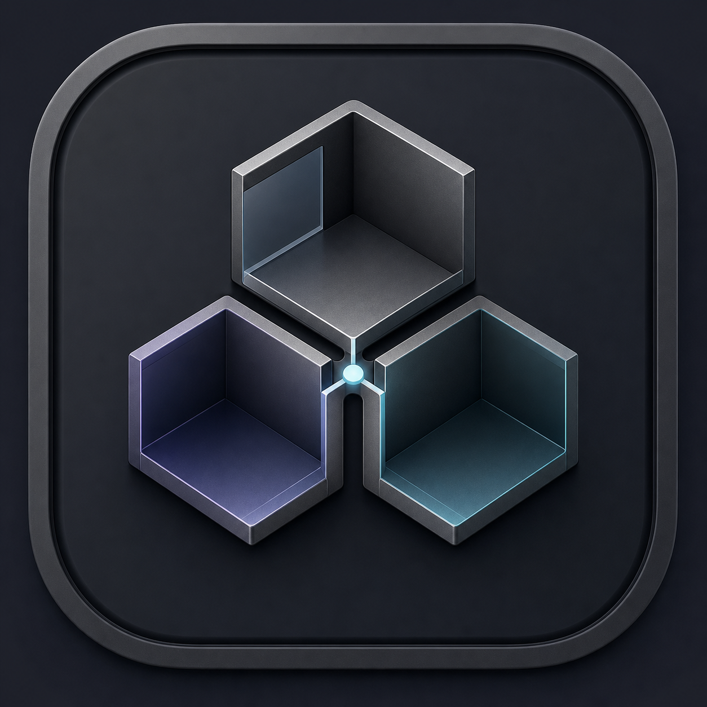
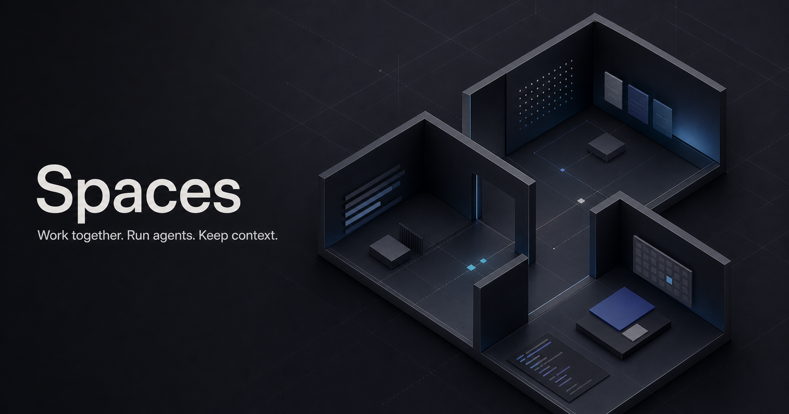

<p align="center">
  
</p>

<h1 align="center">Spaces</h1>

<p align="center">
  Work together. Run agents. Keep context.
</p>

<p align="center">
  <a href="https://github.com/lbrendle/spaces/actions/workflows/ci.yml"></a>
  <a href="./LICENSE"></a>
  
  
</p>



<p align="center">
  <a href="https://spaces-downloads.ghostreader-app.workers.dev/Spaces-0.1.15-universal.dmg"><strong>Download for Mac</strong></a>
  ·
  <a href="./docs/OPEN_SOURCE_INVENTORY.md">Feature inventory</a>
  ·
  <a href="./docs/SELF_HOSTING.md">Self-host</a>
  ·
  <a href="./docs/ARCHITECTURE.md">Architecture</a>
</p>

## See Spaces in motion

https://github.com/user-attachments/assets/f989acfa-c384-451c-8265-abbb767df1a1

<p align="center">
  <sub>76 seconds · multiplayer, live agents, shared work, company memory, and publishing</sub>
</p>

Spaces is the operating system for a small team of people and agents. It puts
the work, conversation, code, knowledge, inbox, calendar, publishing, and live
agent processes in one coherent workspace—without moving repositories or
agent credentials off the computer that owns them.

## One product, not another pile of tools

| Work together | Build with agents | Keep the company memory |
| --- | --- | --- |
| Shared channels, mentions, reactions, projects, issues, boards, people, roles, teams, inbox, and calendars | Claude Code and Codex runtimes, model/effort controls, resumable project chat, live process output, approval queues, worktrees, terminals, and browser panes | Nested Knowledge folders, imported vaults, native notes, wikilinks, backlinks, full-text search, stable agent citations, documents, decisions, and project memory |

| Operate the company | Connect each person | Ship from the same source |
| --- | --- | --- |
| Mail, individual/team/shared calendars, Content Studio, multi-account Instagram/TikTok publishing, and project-linked accounts | Personal GitHub, Google Workspace, and Microsoft 365 accounts stay private to the member who connected them; workspace social accounts are explicitly shared | Open-source desktop and portal, branded builds through environment variables, signed updates, Cloudflare/Sites deployment, D1 persistence, and auditable migrations |

## The coding command center

Every project keeps its conversation and runtime state attached to the project:

- terminal panes persist while you move between chat, browser, Git, and editor
  surfaces;
- an embedded browser stays scoped to the same project workspace;
- Claude Code and Codex can run in isolated worktrees or the project checkout;
- live stdout/stderr, elapsed time, diffs, changed files, session continuity,
  model, effort, and cancellation are inspectable in Spaces;
- Git activity uses the account authenticated on that member’s Mac—never a
  hidden app-owner credential.

Each member connects their own GitHub identity. The desktop’s live GitHub card
uses that Mac’s `gh` session; the portal shows only the current member’s
personal GitHub connection. Shared project/repository links remain visible to
workspace members, but credentials, connection health, and private-repository
access are never inherited from the owner.

Remote/BYO agents still run on the paired desktop that owns their repository
and credentials. The portal coordinates the job and durable result; it does not
turn your codebase into a cloud shell.

## Knowledge that people and agents share

Knowledge behaves like a workspace-native Obsidian vault:

- source → nested folder → note navigation with preserved relative paths;
- Markdown, `[[wikilinks]]`, linked mentions, backlinks, and full-text search;
- read-only folder imports that never rewrite the original vault;
- native shared notes with editable folder paths;
- deterministic folder reconstruction on every paired member device;
- permission-filtered `.hq/KNOWLEDGE.md` context for project agents;
- `spaces_search_knowledge` and `spaces_read_knowledge` agent tools that return
  stable `knowledge:source:path` references for citations.

Imported files, portal notes, and shared documents are stored as workspace
content when explicitly shared. Private collections stay on their owner’s Mac.

## How multiplayer sync works

```text
member's Mac                         shared control plane
┌──────────────────────────┐       ┌────────────────────────────┐
│ Spaces desktop           │       │ Spaces portal             │
│ SQLite · repos · PTYs    │◄─────►│ ChatGPT identity · D1     │
│ browser · Claude/Codex   │ pair  │ membership · OAuth · jobs │
└──────────────────────────┘       └────────────────────────────┘
          │                                      │
          └─ local GitHub / Apple Calendar       └─ Google / Microsoft
             and agent credentials                  Instagram / TikTok
```

Shared projects, channels, issues, workspace-visible Knowledge, team calendars,
Content Studio cards and media references, agent profiles, device presence, and
bounded remote jobs persist in D1 and reconcile across paired devices.
Repositories, live terminal streams, browser history, full transcripts, local
GitHub credentials, and private notes do not cross the control plane during
ordinary sync.

## Agents have native workspace tools

Spaces routes Claude, Codex, and Ritz through one versioned event-harness
contract. Each turn carries an explicit `[Spaces Context]` block with the run,
agent, project, channel, triggering event, reply destination, and working
directory. Sessions remain scoped to one `(channel, agent)` pair; a durable
SQLite queue batches events that arrive while an agent is busy.

The generated dependency-free MCP server and human-readable `.hq/` contract
inside each linked project are the native interface. Agents can read live
channel history, search workspace state, cite Knowledge, create and fully
develop Content Studio cards, create and update work, post across channels,
schedule events, record memory, link entities, and propose external publishing
through the same permission and approval paths as the UI. The same tool surface
also has a structured local CLI fallback for runtimes that do not expose MCP.
Ideas, briefs, copy, assets, review state, selected accounts, and publish
results remain on one canonical card rather than disappearing into agent chat.

Spaces keeps each member's existing Claude Code or Codex login instead of
requiring a second API key just to speak an intermediary protocol. Additive
actions apply automatically; destructive, reassignment, access, and
external-publishing actions wait for a person to approve them.

## What is in this repository

- [`desktop/`](./desktop) — Tauri app, local SQLite, terminals, embedded
  browser, Git/worktrees, agent processes, MCP transport, transcripts,
  documents, Knowledge, mail, calendars, and Content Studio.
- [`portal/`](./portal) — Cloudflare/Sites control plane for ChatGPT identity,
  invitations, roles, pairing, durable shared state, personal/workspace OAuth,
  content sync, and cross-device agent jobs.
- [`docs/`](./docs) — architecture, configuration, self-hosting, and the
  source-audited feature inventory.

Spaces is an alpha. Local product paths are implemented and continuously
checked; real provider transactions still depend on your OAuth applications,
provider review, API enablement, and account permissions. The
[feature inventory](./docs/OPEN_SOURCE_INVENTORY.md) names those boundaries
surface by surface.

## Quick start

You need macOS 13+, Node.js 22, Rust stable, and at least one supported agent
runtime (`claude` or `codex`). Install `gh` for GitHub-backed project surfaces.

```bash
git clone https://github.com/lbrendle/spaces.git
cd spaces/desktop
cp .env.example .env.local
npm ci
npm run tauri dev
```

Run the optional multiplayer portal in another terminal:

```bash
cd portal
cp .dev.vars.example .dev.vars
npm ci
npm run dev
```

The desktop is fully useful locally. Pair a portal deployment when you want
teammate identity, multi-device state, invitations, personal cloud accounts,
shared social accounts, and remote agent jobs. Deployment-specific workspace
URLs and secrets are environment values and are never committed.

## Build and verification

```bash
cd desktop
npm run build
npm run test:knowledge
npm run test:mcp
cargo test --manifest-path src-tauri/Cargo.toml

cd ../portal
npm test
npx tsc --noEmit
npm run lint
```

CI also audits dependencies, Rust formatting/clippy, third-party notices, and
repository secrets. See [CONTRIBUTING.md](./CONTRIBUTING.md) for review rules.

## Documentation

- [Public feature inventory](./docs/OPEN_SOURCE_INVENTORY.md)
- [Architecture and trust boundaries](./docs/ARCHITECTURE.md)
- [Self-hosting](./docs/SELF_HOSTING.md)
- [Configuration reference](./docs/CONFIGURATION.md)
- [Security policy](./SECURITY.md)
- [Contribution guide](./CONTRIBUTING.md)
- [Third-party license inventory](./THIRD_PARTY_NOTICES.md)

## License

Apache License 2.0. See [LICENSE](./LICENSE) and [NOTICE](./NOTICE).
